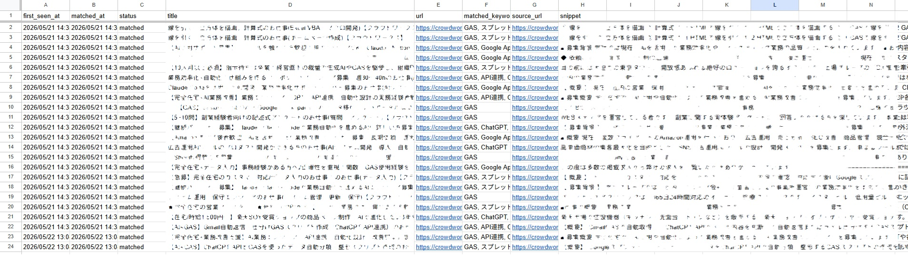
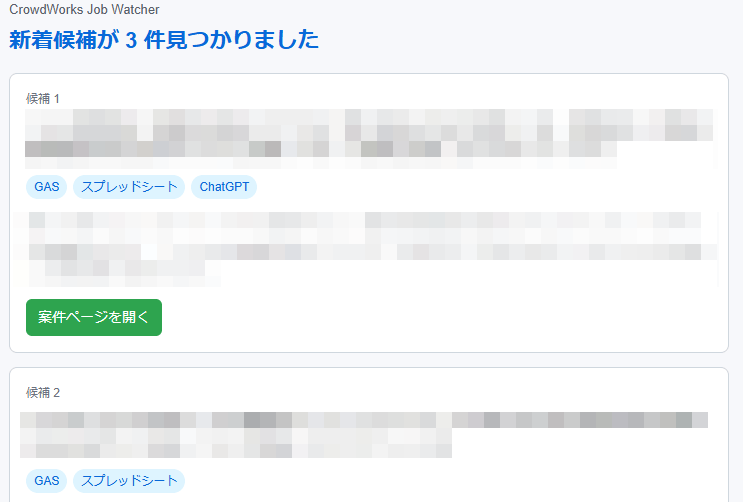

# CrowdWorks Job Watcher

Google Apps Scriptでクラウドワークスの検索結果を定期確認し、新着案件をスプレッドシートに保存する自動化ツールです。

GAS、Google Apps Script、スプレッドシート、API連携、ChatGPT、Geminiなどのキーワードに合う案件を検出し、必要に応じてGoogle Chatまたはメールで通知できます。

## できること

- 指定したクラウドワークス検索URLを取得
- 検索結果から案件候補を抽出
- 応募期限が終了している案件を除外
- 在宅勤務・リモートに該当しない案件を除外
- 保存済みURLと照合し、新着案件だけを処理
- 新着候補だけ詳細ページを取得
- キーワードに一致した案件を判定
- スプレッドシートへ保存
- Google Chatまたはメールへ通知
- Apps Scriptの時間主導型トリガーで4時間おきに実行

## セットアップ

1. 保存先のGoogleスプレッドシートを作成します。
2. Apps Scriptプロジェクトを作成します。
3. `src/Code.js` の内容をApps Scriptの `Code.gs` に貼り付けます。
4. `src/appsscript.json` の内容をApps Scriptのマニフェストへ反映します。
5. Apps Scriptのプロジェクト設定で、以下のスクリプトプロパティを設定します。

| キー | 必須 | 例 |
| --- | --- | --- |
| `SPREADSHEET_ID` | 必須 | `1abc...xyz` |
| `SEARCH_URLS` | 必須 | `["https://crowdworks.jp/public/jobs/search?search%5Bkeywords%5D=GAS"]` |
| `SEARCH_MAX_PAGES` | 任意 | `3` |
| `KEYWORDS` | 任意 | `["GAS","Google Apps Script","スプレッドシート","API連携","ChatGPT","Gemini"]` |
| `REQUIRE_REMOTE` | 任意 | `true` |
| `REMOTE_KEYWORDS` | 任意 | `["在宅","在宅勤務","完全在宅","リモート","フルリモート","リモートワーク","オンライン"]` |
| `CHAT_WEBHOOK_URL` | 任意 | `https://chat.googleapis.com/...` |
| `NOTIFY_EMAIL` | 任意 | `you@example.com` |

6. Apps Scriptエディタで `setup()` を1回実行します。
7. 動作確認として `checkNewJobs()` を手動実行します。
8. 問題なければ `installTimeTrigger()` を1回実行し、4時間おきの自動実行を設定します。

## スクリプトプロパティ

### `SPREADSHEET_ID`

案件を保存するGoogleスプレッドシートのIDです。

スプレッドシートURLの `/d/` と `/edit` の間の文字列を指定します。

```txt
https://docs.google.com/spreadsheets/d/SPREADSHEET_ID/edit
```

### `SEARCH_URLS`

監視したいクラウドワークス検索URLをJSON配列で指定します。

```json
["https://crowdworks.jp/public/jobs/search?search%5Bkeywords%5D=GAS"]
```

複数URLを監視する場合は、次のように追加します。

```json
[
  "https://crowdworks.jp/public/jobs/search?search%5Bkeywords%5D=GAS",
  "https://crowdworks.jp/public/jobs/search?search%5Bkeywords%5D=Google%20Apps%20Script"
]
```

### `SEARCH_MAX_PAGES`

検索結果を何ページ目まで確認するかを指定します。

未設定の場合は `1` ページ目だけ確認します。初回から大きな値にすると詳細ページ取得数が増えるため、まずは `2` または `3` 程度がおすすめです。

### `KEYWORDS`

案件本文に含まれていたらマッチ扱いにするキーワードです。

未設定の場合は、コード内のデフォルトキーワードを使います。

```json
["GAS","Google Apps Script","スプレッドシート","API連携","ChatGPT","Gemini"]
```

### `REQUIRE_REMOTE`

在宅勤務・リモート案件だけを保存したい場合に使います。

未設定の場合は `true` として扱い、`REMOTE_KEYWORDS` のいずれかを含む案件だけを保存します。

在宅・リモート条件で絞り込まない場合は、次のように設定します。

```txt
false
```

### `REMOTE_KEYWORDS`

在宅勤務・リモート案件と判断するためのキーワードです。

未設定の場合は、コード内のデフォルトキーワードを使います。

```json
["在宅","在宅勤務","完全在宅","リモート","フルリモート","リモートワーク","オンライン"]
```

### `CHAT_WEBHOOK_URL`

Google Chatへ通知する場合に設定します。未設定ならGoogle Chat通知は行いません。

### `NOTIFY_EMAIL`

メール通知を受け取りたい場合に設定します。未設定ならメール通知は行いません。

メールはHTML形式で送信され、案件ごとにタイトル、マッチしたキーワード、本文抜粋、案件ページへのリンクを確認できます。

## スプレッドシートの列

`setup()` を実行すると、`jobs` シートに次の列が作成されます。

- `first_seen_at`: 最初に見つけた日時
- `matched_at`: キーワードに一致した日時
- `status`: `matched` または `seen`
- `title`: 案件タイトル
- `url`: 案件URL
- `matched_keywords`: 一致したキーワード
- `source_url`: 取得元の検索結果URL
- `snippet`: 案件本文の抜粋

## 取得結果イメージ

`checkNewJobs()` を実行すると、条件に合う新着案件が次のようにスプレッドシートへ保存されます。



## メール通知イメージ

`NOTIFY_EMAIL` を設定すると、条件に合う新着案件をHTMLメールで確認できます。

案件ごとにタイトル、マッチしたキーワード、本文抜粋、案件ページへのリンクを表示します。



## 運用メモ

このツールは控えめに動く設計にしています。

検索結果は4時間おきに確認し、詳細ページは「まだ保存していないURL」だけ取得します。また、応募期限が終了している案件や、在宅勤務・リモートに該当しない案件は保存しません。

Apps Scriptの時間間隔トリガーでは3時間おきが選べないため、現在は4時間おきにしています。

## 今後の改良案

- メール通知の本文を見やすくする
- Google Chat通知を整える
- ChatGPT APIで案件をスコアリングする
- 自分に合う案件だけを通知する
- スプレッドシートにAI評価列を追加する
